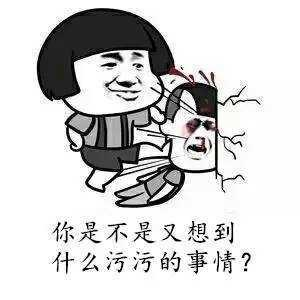
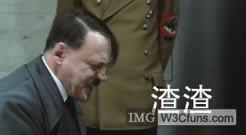

#教你如何“打飞机”
道友们看到这标题是不是心血来潮， 。

由于楼主最近晚上闲来无事，前端历程也不到一年，JS水平也是 ，又对游戏挺感兴趣的，所以心血来潮，用这个良辰写个小小游戏练练手。

好了，废话不多说，“打飞机”现在开始，游戏很简单，是仿微信上面的打飞机小游戏的，玩法很简单，自己控制的飞机随鼠标移动自动发射子弹，敌方飞机分为3种大小，种类不同血量即不同，当自己飞机中敌方子弹或碰到敌方飞机则少一命，最后命为0则game over，游戏会记录所获得的积分。
##整个游戏分析
###1.资源
整理好各种图片，飞机按类型分类命名，一组飞机（一只飞机正常状态到死亡会有好几张图片组成）命名相似。

敌机

enemy1.png

enemy1_down（n）.png

enemy1_down（n）.png

enemy1_down（n）.png

enemy1_down（n）.png

英雄(同敌机)......
###2.游戏状态(state)
   START : 进入到游戏 , 即进入到游戏主界面，并未开始游戏页面初始化状态为 START

	详解：

	     1、背景在动

	     2、显示飞机大战的图像

   STARTING : 过渡，开始状态， 与游戏进行状态的过渡，用户点击鼠标左键时，由START --> STARTING

   RUNNING : 游戏正式开始，实现飞机大战的过程

	1、当准备图像中的最后一幅显示完毕时，STARTING --> RUNNING

    2、当鼠标从canvas所在区域外移入时，并且状态为PAUSE是， PAUSE --> RUNNING

   PAUSE : 暂停，鼠标移出canvas所在的区域 RUNNING --> PAUSE

   GAME_OVER:结束，LIFE为0时(销毁过程已经结束)
###3.计时器 setInterval
   整个游戏很多的东西都在使用计时器（英雄、敌机、子弹、天空等等），因此设置这么多计时器是不行的，这里想到了只用一个计时器来控制所有的模块。

   这里有个问题：如何控制图像组件的速度

   解决:计时器固定刷新频率 : 1000 / 100，每一个图像组件都有自己的速度 （20 --> 1000 / 20），让计时器测量图像组件是否到达运动时间，如果到达则运动，否则不动。
###4.设计元素
   1、 数据对象：只负责封装基本数据   例：天空-宽度高度移动速度等等 var SKY={width:480,height:600,speed:20}

   2、 业务对象：负责业务逻辑的计算   例：处理天空运动var Sky=function(SKY){...}

